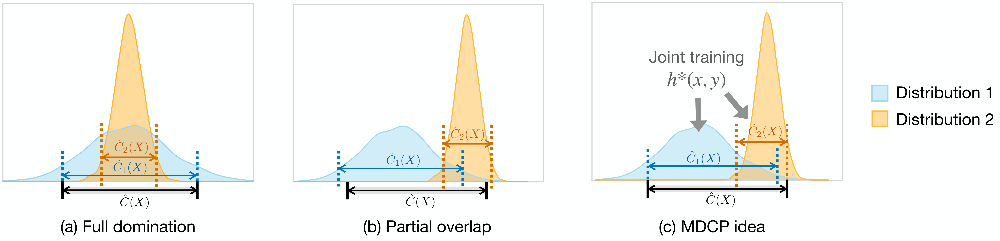

# MDCP

This repo serves as the implementation for the paper ["Multi-Distribution Robust Conformal Prediction"](https://ying531.github.io/assets/files/MDCP_paper.pdf).



> **Table of Contents**
> - [Installation](#installation)
> - [Simulation Experiments](#simulation-experiments)
> - [Real-data Applications](#real-data-applications)
> - [Figures](#figures)
> - [Codebase Overview](#codebase-overview)


## Installation

**1. Create & activate an environment**

*   **Windows (PowerShell)**
    ```powershell
    python -m venv mdcp
    .\mdcp\Scripts\Activate.ps1
    ```

*   **macOS/Linux (bash/zsh)**
    ```bash
    python -m venv mdcp
    source mdcp/bin/activate
    ```

**2. Install dependencies**

Once the environment is active:
```bash
pip install --upgrade pip
pip install -r requirements.txt wilds
```

---

## Simulation Experiments

All simulation scripts live under `notebook/` and write artifacts to `eval_out/` (see `model/const.py` for exact folders). The paper reports averages over 100 independent runs per configuration over contiguous seed ranges starting from the base seed.

### Linear Model
Run the linear simulation:
```bash
python notebook/eval_linear.py --num-trials 1 --base-seed 34567 --lambda-sample-limit 50
```
> Outputs will be saved under `eval_out/linear/`, including both classification and regression results.

### Nonlinear Model
Run the nonlinear simulation:
```bash
python notebook/eval_nonlinear.py --num-trials 1 --base-seed 23456
```
> Outputs will be saved under `eval_out/nonlinear/`.

### Temperature Scaling
Run the temperature scaling experiment:
```bash
python notebook/eval_temperature.py --num-trials 1 --base-seed 34567 --lambda-sample-limit 50 --temperatures 0.5 1.5 2.5 3.5 4.5 5.5
```
> Outputs will be saved under `eval_out/temperature/eval_out/`.


## Real-data Applications

Three real-world data evaluations are supported: [FMoW](https://wilds.stanford.edu/datasets/#fmow), [PovertyMap](https://wilds.stanford.edu/datasets/#povertymap) from [WILDS](https://github.com/p-lambda/wilds), and [MEPS](https://meps.ahrq.gov/mepsweb/).

The evaluation scripts are under `meps`, `wilds\fmow`, and `wilds\poverty`. Final paper numbers average 100 runs per dataset/scenario using contiguous seed ranges starting from the base seed.

**Prerequisites:**

1.  Clone the upstream WILDS repo (provides the `examples/` modules used by Poverty/FMoW):
    ```bash
    python -m wilds.setup_wilds_repo
    ```
    The helper places the checkout at `external/wilds_upstream`; pass `--wilds-repo` if you keep it elsewhere.

2.  Download WILDS datasets (stores under `data/`):
    ```bash
    python -m wilds.download_datasets --dataset poverty --root data --unpack
    python -m wilds.download_datasets --dataset fmow --root data --unpack
    ```
    If TLS inspection blocks the download, run `python wilds/download_wilds_insecure.py --dataset <name> --root data --unpack` and move the extracted folders under `data/`.

3.  Prepare CSVs for MEPS

    Follow [the download guide](https://github.com/yromano/cqr/tree/master/get_meps_data), then drop the three cleaned files into `meps/data/` with names `meps_*_reg.csv`.

### MEPS

```bash
# Run the evaluator (outputs default to `eval_out/meps/`)
python -m meps.eval --panels 19 20 21 --num-trials 1 --base-seed 45678 --lambda-sample-limit 200 --target-transform log1p --output-dir eval_out/meps/runs/base
```

### PovertyMap (WILDS)

```bash
# 1. Create 2014-2016 split
python wilds/poverty/create_training_split.py --repo-root . --train-frac 0.375 --seed 0 --years 2014 2015 2016

# 2. Train ResNet18 with a replaced gaussian head (default outputs under `eval_out/poverty/training/`)
python wilds/poverty/train_resnet.py --repo-root . --density-head gaussian --subset all --epochs 50 --batch-size 32 --output-dir eval_out/poverty/training/run_gaussian_all

# 3. Predict on the holdout set
python wilds/poverty/predict_density.py --repo-root . --checkpoint eval_out/poverty/training/run_gaussian_all/best_model.pth --config-path eval_out/poverty/training/run_gaussian_all/config.json --subset all --density-head gaussian --output-dir eval_out/poverty/predictions/run_gaussian_all

# 4. Learn lambda, calibrate and evaluate
python wilds/poverty/analysis/eval.py --alpha 0.1 --cal-frac 0.375 --test-frac 0.5 --num-trials 1 --seed 90000 --gamma-grid 0.0 0.001 0.01 0.1 1.0 10.0 100.0 1000.0 --y-grid-size 512 --y-margin 0.05 --output-dir eval_out/poverty/mdcp/run_gaussian_trial1
```

### FMoW (WILDS)

```bash
# 1. Create 2016-only splits
python wilds/fmow/pipeline/cli.py split --root data/fmow_v1.1 --wilds-repo external/wilds_upstream --output eval_out/fmow/splits/2016_region --train-frac 0.375 --seed 0

# 2. Train DenseNet121 on the training set
python wilds/fmow/pipeline/cli.py train --root data/fmow_v1.1 --wilds-repo external/wilds_upstream --train-idx eval_out/fmow/splits/2016_region/train_idx.npy --holdout-idx eval_out/fmow/splits/2016_region/holdout_idx.npy --output eval_out/fmow/training/run_densenet121 --epochs 30 --batch-size 32

# 3. Predict on the holdout set
python wilds/fmow/pipeline/cli.py predict --root data/fmow_v1.1 --wilds-repo external/wilds_upstream --holdout-idx eval_out/fmow/splits/2016_region/holdout_idx.npy --checkpoint eval_out/fmow/training/run_densenet121/checkpoint_best.pt --output eval_out/fmow/predictions/run_densenet121 --batch-size 128

# 4. Learn lambda, calibrate and evaluate
python wilds/fmow/analysis/eval.py --prediction-dir eval_out/fmow/predictions/run_densenet121 --num-trials 1 --base-seed 70000 --alpha 0.1 --gamma-grid 0.0 0.001 0.01 0.1 1.0 10.0 100.0 1000.0 --lambda-sample 64 --output eval_out/fmow/mdcp/run_densenet121_trial1.npz
```

> Use `--wilds-repo` if your upstream checkout is not at `external/wilds_upstream`.


## Figures

Run these commands from the repo root after the corresponding evaluation artifacts exist. Outputs will be saved under `eval_out/paper_figures/`.

Reproduce simulation plots:

```bash
# Linear
python notebook/paper_figures/plot_linear.py --eval-dir eval_out/linear --output-dir eval_out/paper_figures

# Nonlinear
python notebook/paper_figures/plot_nonlinear.py --eval-dir eval_out/nonlinear --output-dir eval_out/paper_figures

# Temperature
python notebook/paper_figures/plot_temperature.py --eval-root eval_out/temperature/eval_out --output-dir eval_out/paper_figures
```

Reproduce real-data plots:

```bash
# PovertyMap
python notebook/paper_figures/plot_poverty.py --input-dir eval_out/poverty/mdcp --output-dir eval_out/paper_figures

# PovertyMap target distribution
python notebook/paper_figures/plot_poverty_target.py --repo-root . --output eval_out/paper_figures/poverty_target.pdf --summary-output eval_out/paper_figures/poverty_target_summary.csv

# FMoW
python notebook/paper_figures/plot_fmow.py --input-dir eval_out/fmow/mdcp --output-dir eval_out/paper_figures

# MEPS
python notebook/paper_figures/plot_meps.py --input eval_out/meps/meps_raw --output eval_out/paper_figures --coverage-target 0.9
```


## Codebase Overview

```
MDCP/
├── model/
│   ├── MDCP.py
│   └── const.py
├── notebook/
│   ├── eval_linear.py
│   ├── eval_nonlinear.py
│   ├── eval_temperature.py
│   └── paper_figures/
├── meps/
│   └── eval.py
├── wilds/
│   ├── poverty/
│   └── fmow/
├── data/ (downloaded datasets)
└── eval_out/ (experiment outputs + figures)
```
